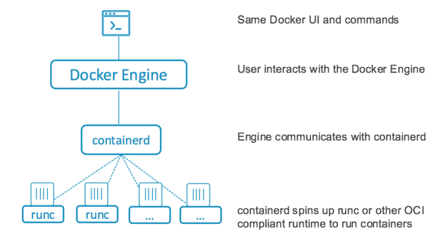

footer: June 12, 2020
slidenumbers: true

# What is a container?

*Lunch and Learn series* - **remote edition**

Nick Brandaleone
AWS Specialist SA - Containers

--- 
## Ground Rules

- Ask questions
- Try to be on _mute_ when not asking questions
- I will be moving quickly
- https://github.com/nbrandaleone/what-is-a-container
- I will be using Cloud-9 (Ubuntu OS)  for a demo

--- 
## Agenda

| Lesson                       | Time | 
-------------------------------| :------: | 
Why are containers so popular? | 5 minutes |
What is the magic? | 5 minutes |
Demo, using BASH | 20 minutes |
Firecracker demo | 5 minutes |

---
# Why so popular?

- Code portability issue is solved
- Faster start-up time makes them preferrable to VMs
- Greater hardware efficiency makes them cheaper
- Isolation provides security (**not perfect though**)
- Docker tooling is **easy to use**

---
# What is the magic?

## Containers do not *really* exist

- Namespaces
- cgroups (Linux capabilities + Seccomp)
- COW or layered filesystem

**Linux** Kernel tricks - Windows should use .Net Core

---
# Namespaces

*CGROUP* - limit cpu/memory for a group of processes.
*MNT*: It allows a process to have its own filesystem. 
*PID*: The pid namespace gives a process its own view of /proc.
*NET*: Isolated network stack. 
*UTS*: System’s hostname and domain name. 
*USER*: The user namespace maps the uids to different uids. 
*IPC*: message queues and shared memory.

---
# Cgroups

Where namespaces isolate a process, *cgroups* enforce fair resource sharing between processes.

For example:
- how much memory a process can use
- how much CPU can a process use
- how many children processes can be spawned

---
# Layered Filesystem

- Layered Filesystems are how we can efficiently move whole machine images around.
- Also known as *tarballs*...

- Storage Drivers:
    - overlay2
    - aufs (older version)

---
# Vocabulary

- Docker -> the company that made it easy to use containers. Purchased by Mirantis in late 2019.
- OCI -> The open source components of Docker
    - containerd (high-level interface)
    - runc (low level)

---
# How they fit together

---
# Under the hood

No `fork() and exec()`

We now `clone() or unshare()`

### Docker and Kubernetes are written in *Go*, not *C*

---
# [fit] Demo time! 

---
## Thank you

**Stay Safe and Sane**

---
# Resources:

- https://www.infoq.com/articles/build-a-container-golang/
- https://gist.github.com/christophberger/58505418133d474486a88f958d8ea14b
- https://www.nickaws.net/linux/2020/03/05/Containers-are-not-magic.html

---
# Videos:

- https://www.youtube.com/watch?time_continue=2&v=sK5i-N34im8
- https://www.youtube.com/watch?v=Utf-A4rODH8
- https://containersummit.io/events/nyc-2016/videos/building-containers-in-pure-bash-and-c

---
# Workshops

- http://redhatgov.io/workshops/containers_the_hard_way/
- https://ericchiang.github.io/post/containers-from-scratch/
- https://github.com/riyazdf/dockercon-workshop

---
